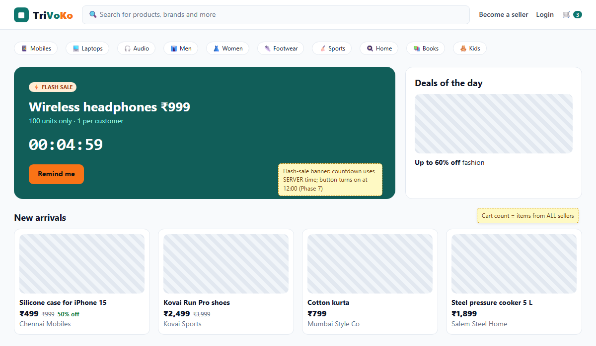
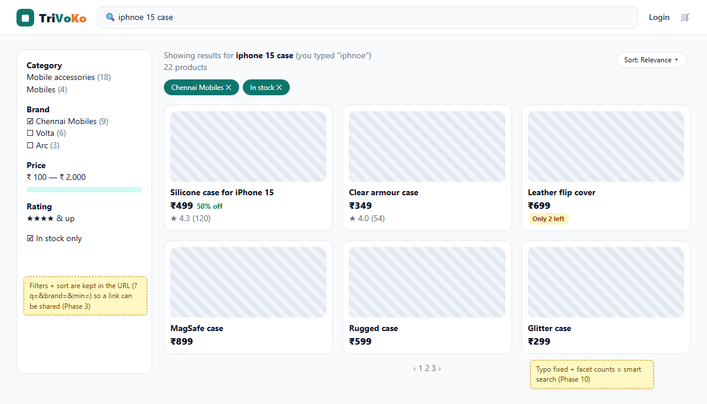
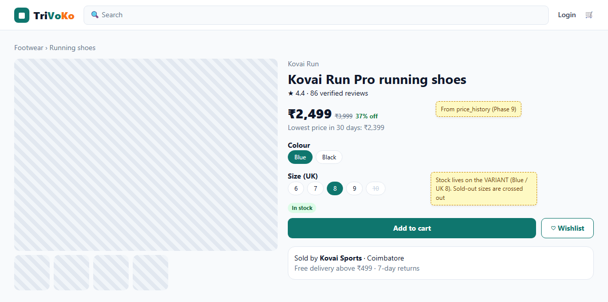
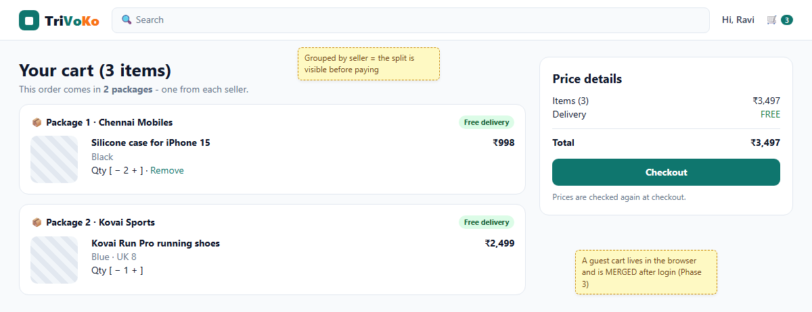
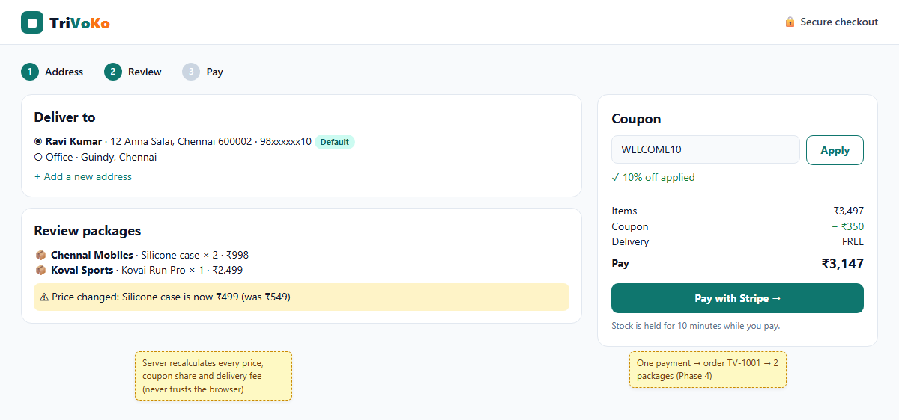
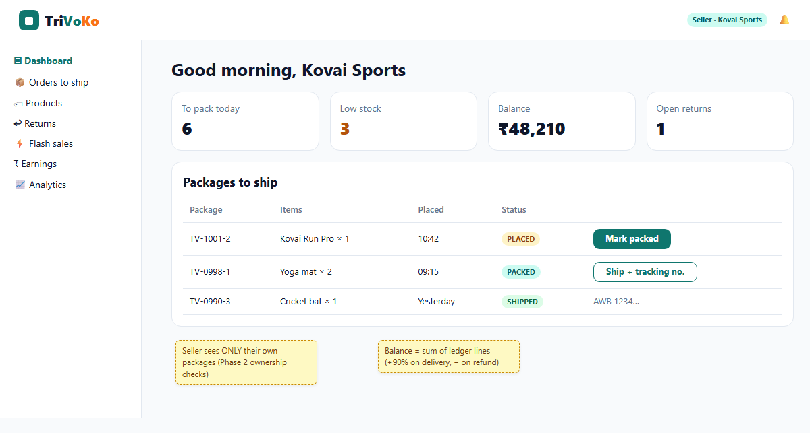

# 1. Sketches of the 6 key pages

These are **low-detail sketches**: they fix the layout, the content of each page and the rules behind it - not the final pixels. Striped boxes are product photos. Yellow notes explain the rule behind a part of the page and the phase that builds it.

>> An architect shows the family a simple drawing of each room before building: where the door is, where the kitchen goes. Moving a wall on paper costs nothing; moving it after the bricks are laid costs a lot. These sketches are that paper.

Design rules used on every page:

- **Teal** (`brand`) for trust: buttons, links, the logo. **Saffron** (`accent`) only for deals and the flash sale, so the eye goes there.
- White cards with soft borders on a light grey page; the same cards in dark grey in dark mode.
- Prices: big selling price, crossed-out MRP, green "% off". Money in Indian format (₹2,499; ₹48,210).
- Every page also has a phone layout and a dark mode (checked in Phase 3).

## 1.1 Home

## 1.2 Search / listing

## 1.3 Product page

## 1.4 Cart

## 1.5 Checkout

## 1.6 Seller dashboard

> The sketches are made from `docs/sketches/sketches.html` (render with `tools/sketches/render.ps1`), so a change is quick: edit the HTML and render again.
